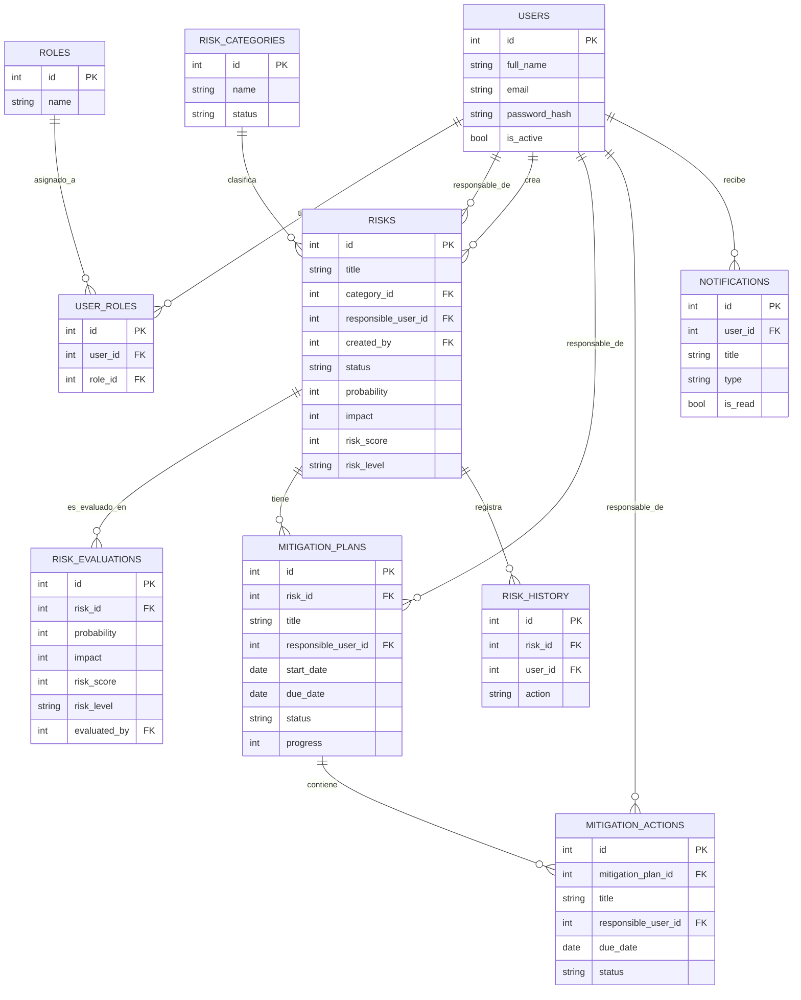

# Diagrama Entidad-Relacion — RiskOps

```mermaid
erDiagram
    USERS ||--o{ USER_ROLES : tiene
    ROLES ||--o{ USER_ROLES : asignado_a
    RISK_CATEGORIES ||--o{ RISKS : clasifica
    USERS ||--o{ RISKS : responsable_de
    USERS ||--o{ RISKS : crea
    RISKS ||--o{ RISK_EVALUATIONS : es_evaluado_en
    RISKS ||--o{ MITIGATION_PLANS : tiene
    RISKS ||--o{ RISK_HISTORY : registra
    MITIGATION_PLANS ||--o{ MITIGATION_ACTIONS : contiene
    USERS ||--o{ MITIGATION_PLANS : responsable_de
    USERS ||--o{ MITIGATION_ACTIONS : responsable_de
    USERS ||--o{ NOTIFICATIONS : recibe

    USERS {
        int id PK
        string full_name
        string email
        string password_hash
        bool is_active
    }
    ROLES {
        int id PK
        string name
    }
    USER_ROLES {
        int id PK
        int user_id FK
        int role_id FK
    }
    RISK_CATEGORIES {
        int id PK
        string name
        string status
    }
    RISKS {
        int id PK
        string title
        int category_id FK
        int responsible_user_id FK
        int created_by FK
        string status
        int probability
        int impact
        int risk_score
        string risk_level
    }
    RISK_EVALUATIONS {
        int id PK
        int risk_id FK
        int probability
        int impact
        int risk_score
        string risk_level
        int evaluated_by FK
    }
    MITIGATION_PLANS {
        int id PK
        int risk_id FK
        string title
        int responsible_user_id FK
        date start_date
        date due_date
        string status
        int progress
    }
    MITIGATION_ACTIONS {
        int id PK
        int mitigation_plan_id FK
        string title
        int responsible_user_id FK
        date due_date
        string status
    }
    RISK_HISTORY {
        int id PK
        int risk_id FK
        int user_id FK
        string action
    }
    NOTIFICATIONS {
        int id PK
        int user_id FK
        string title
        string type
        bool is_read
    }
```